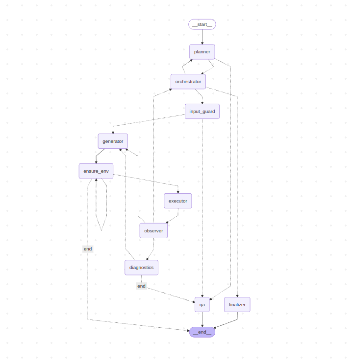

# Genomeer
**MetagenomicAgent** – Intelligent workflows for metagenomics analysis powered by agentic frameworks.

<p align="center">
  <a href="https://www.python.org/downloads/">
    
  </a>
  <a href="./LICENSE">
    
  </a>
  <a href="#">
    
  </a>
  <a href="./docs">
    
  </a>
  <a href="#">
    
  </a>
</p>

Genomeer is an **AI-driven agent** designed to support **metagenomics analysis pipelines**. 
It uses **LangGraph** for agent workflow orchestration, **micromamba** for isolated runtime environments, and integrates with modern UIs (e.g., OpenWebUI) to provide a smooth human-in-the-loop experience. 
Genomeer is for:  
- **Bioinformaticians** who want reproducible agent workflows.  
- **Researchers** running quick exploratory metagenomics tasks without complex pipelines.  
- **Developers** interested in agentic design applied to biology.  

<br>

## ✨ Features  
- **Agentic workflow** with planning, input validation, execution, observation, and finalization nodes.  
- **Artifact publishing** with shareable download links.  
- **Pluggable tools**: ORF prediction, k-mer spectra, GC distribution, gene finding, and more.  
- **Notebook test cases** for direct experimentation.  
- **Virtual environments** managed via `micromamba` or `venv`.  
- **MCP Tools**: We are working on this use case  

<br>

## 🚀 Installation  

Clone the repo:  

```bash
git clone 'this repository'
cd genomeer
```

### Option 1 – Use a virtual environment (recommended)
```bash
python -m venv venv
source venv/bin/activate   # (Linux/macOS)
venv\Scripts\activate      # (Windows)
```

Then install Genomeer:

```bash
pip install -e .       # Development mode OR  
pip install genomeer   # PyPI release (available soon)
```
or install directly our agentic library in your existing environment.

<br>

## 🧪 Usage
Open the [`tests/`](./genomeer/tests) folder to explore notebooks with pre-configured test cases.

Example (Jupyter Notebook):

```python
from genomeer.agent.v2 import BioAgent

agent = BioAgent(path="./data",
    llm="gpt-oss:20b",
    source="Custom",
    use_tool_retriever=True,
    timeout_seconds=600,
    base_url="http://10.52.88.30:11434/v1",
    api_key=None
)
agent.go(
   "Compute k-mer spectra for this FASTA file", 
   mode="dev",
   attachments=["/home/sequence.fasta"]
)
```

If you installed Genomeer inside a new venv, ensure your Jupyter kernel is connected to that environment Then select venv-genomeer as the kernel inside Jupyter/VSCode.

```bash
pip install ipykernel
python -m ipykernel install --user --name=venv-genomeer
```

<br>

## 📊 Graph (v2)

Below is the Genomeer agent workflow graph (LangGraph v2)


<br>

## 🛠️ Tech Stack

- LangGraph – agent workflow orchestration
- LangChain – LLM & message handling
- Micromamba / Conda – runtime environment manager
- FastAPI – backend APIs for artifacts
- Python 3.11+ – core engine
- Jupyter Notebooks – testing and tutorials

<br>

## Environment Variables
Create a .env file in the repo root. You can make a copy form `.env.example` and edit.
```python
# Model name:
# ----------------------------------------------------------
# Optional: Model name
GENOMEER_LLM="gpt-oss:20b"

# Model config custom:
# ----------------------------------------------------------
# Optional: Custom model serving configuration
CUSTOM_MODEL_BASE_URL=http://localhost:8000/v1
CUSTOM_MODEL_API_KEY=your_custom_api_key_here


# Model config other:
# ----------------------------------------------------------
# Required: Anthropic API Key for Claude models
ANTHROPIC_API_KEY=your_anthropic_api_key_here
# Optional: OpenAI API Key and endpoint url (if using OpenAI models)
OPENAI_API_KEY=your_openai_api_key_here
OPENAI_ENDPOINT=openai_endpoint
# Optional: AWS Bedrock Configuration (if using AWS Bedrock models)
AWS_BEARER_TOKEN_BEDROCK=your_bedrock_api_key_here
AWS_REGION=us-east-1


# Optional:
# ----------------------------------------------------------
# Genomeer data path (defaults to ./data)
GENOMEER_DATA_PATH=/path/to/your/data
# Optional: Timeout settings
GENOMEER_TIMEOUT_SECONDS=600
# Genomeer data path (defaults to .genomeer_runs)
GENOMEER_RUN_DIR=/path/to/your/data
# Genomeer model temprature (default: 0.7)
GENOMEER_MODEL_TEMPERATURE=0.7
# Genomeer model source. You hvae to set one. (default None, can be determined automatically)
GENOMEER_MODEL_SOURCE="OpenAI", "AzureOpenAI", "Anthropic", "Ollama", "Gemini", "Bedrock", "Groq", "Custom"
# Agent tools directory
BIOAGENT_TOOLS_DIR=
# Auto Install BioAgent tools
BIOAGENT_AUTO_INSTALL=1
# Homefolder where the agent will install envs in which we will run tools
BIOAGENT_RUNTIME_ENV_HOME=."/runtime/envs"
# Per run temp storage folder
BIOAGENT_TMP_DIR="/tmp/bioagent"
```

<br>

## 📚 Documentation
- [Genomeer Notebooks](./genomeer/tests)
- A wiki will be added soon

<br>

## 🧭 Roadmap
- [ ] **Stabilize v2** (agent state graph, retries, diagnostics)
- [ ] **Add metagenomic pipeline tools** (jellyfish/k-mers, fastp, minimap2, metaSPAdes wrappers)
- [ ] **Support MCP tools** (Model Context Protocol tool integration)
- [ ] **Add follow-ups in workflow** (explicit ask/confirm steps per node)
- [ ] **Auto–Manual mode**  _Option to inject user guidance at each step or run fully automatic_
- [ ] **Introduce UI** _OpenWebUI-based interface or custom UI from scratch_
- [ ] **Extend ORF prediction with LLM-HMM hybrids**
- [ ] **Add taxonomic classification modules**
- [ ] **Cloud artifact hosting backend**
- [ ] **Streamlined integration with Galaxy workflows**

<br>

## 🤝 Contributing

Contributions are welcome!

- Fork the repo
- Create your feature branch (git checkout -b feature/amazing)
- Commit your changes (git commit -m 'Add amazing feature')
- Push to the branch (git push origin feature/amazing)
- Open a Pull Request

<!-- ## License
Distributed under the MIT License. See LICENSE for details. -->